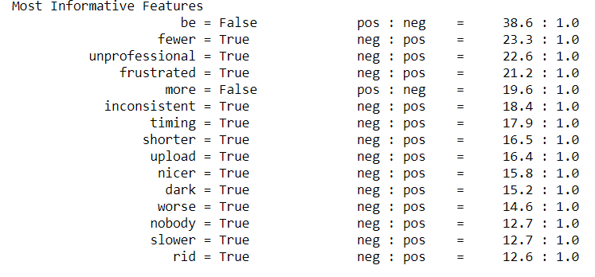

# Simple-Sentiment-Analysis-using-NLTK for scoring summaries

### Introduction: 
I built a sentiment analysis model that can classify classie-evals comments for courses taught in Stony Brook University as either positive or negative. I trained the model using comments from approximately 1100 courses.

### Process: 

The Algorithm : 
Tokenize, clean and lemmatize the data and took only the adjectives from the comments. 
Created a frequency distribution and found the most used words in all of the comments. The top 5000 were used as the features.  

Make features vectors:
Created a dictionary representation of each comment. The key in the dictoinary was each of the top words and the corresponding value was True of False for whether 'Word was in the comment or not' 
Divdided the data into train test split. 
Used 5 different classification models to train on the data. Namely: 

Classifiers for an ensemble model from NLTK-ScikitLearn library: 
Naive Bayes (NB)
Multinomial NB
Bernoulli NB
Logistic Regression
Stochastic Gradient Descent Classifier - SGD
Support Vector Classification - SVC


classifier.py: Created a classifier class (EnsembleClassifier) that takes votes from each classifier and takes the mode of the votes to give the final decision with a certain confidence level.
Sentiment function of classifier.py Can predict the sentiment of a single review, i.e. a score which weights (between 0 and 1) how positive/negative a summary is. 

The most used words from the feature set in each category - 



## How to run?
 * The pretrained models are in `/pickled_algos` which were trained on positive and negative comments of students on classie-evals from different courses of Stony Brook University.
 * Copy the summaries that you generated using skip-thoughts into `/scoreSum/summaries`
 * In the main function of `classifier.py`, do:
 ```
 text = read_text("summaries\your_file_name_summ.txt")
 sentiment_type, score = sentiment(text)
 ```

# Acknowledgement

 * Followed [this](https://pythonprogramming.net/sentiment-analysis-module-nltk-tutorial/) tutorial.
 * Dataset - Created our own dataset
